# 🚀 E-Nav 导航站
# 目录
- [产品特性](#产品特性)
- [💻 后台管理](#-后台管理)
- [🚀 快速部署](#-快速部署-1)
  - [Docker部署](#方式一docker部署推荐)
  - [Docker Compose部署](#docker-compose-部署)
  - [本机一键脚本部署](#方式二本机一键脚本部署)
  - [手动部署](#方法三手动部署)
- [🛠️ 技术架构](#️-技术架构)
- [📦 项目结构](#-项目结构)
- [🔧 常用命令](#-常用命令-1)
- [⚠️ 注意事项](#️-注意事项)
- [🤝 联系我们](#-联系我们)
- [📜 开源协议](#-开源协议)
<div align="left">


<p>一个优雅、现代的个人导航站解决方案，让您的网址管理更轻松、更智能！制作不易，欢迎点个免费的Star⭐</p>

[演示站点](https://enavdemo.ecouu.com) | [使用文档](https://github.com/ecouus/E-Nav/blob/main/README.md) | [问题反馈](https://github.com/ecouus/E-Nav/issues)
</div>

##  产品特性

<table>
  <tr>
    <td width="50%">
      <h3 align="center">🎯 快速部署</h3>
      <ul>
        <li> 一键式安装/卸载</li>
        <li> Docker容器化部署</li>
        <li> 自动更新维护</li>
        <li> 极简配置要求</li>
      </ul>
    </td>
    <td width="50%">
      <h3 align="center">👨‍💻 简单管理</h3>
      <ul>
        <li> 简洁后台界面</li>
        <li> 安全权限控制</li>
        <li> 响应式设计</li>
        <li> 明暗主题切换</li>
      </ul>
    </td>
  </tr>
  <tr>
    <td width="50%">
      <h3 align="center">🎨 智能图标</h3>
      <ul>
        <li>自动获取favicon</li>
        <li>支持自定义上传</li>
        <li>优雅降级处理</li>
      </ul>
    </td>
    <td width="50%">
      <h3 align="center">🔍 搜索功能</h3>
      <ul>
        <li>实时搜索过滤</li>
        <li>全文本搜索</li>
        <li>集成搜索引擎</li>
      </ul>
    </td>
  </tr>
  <tr>
    <td width="50%" colspan="2">
      <h3 align="center">🛡️ 安全特性</h3>
      <ul>
        <li>密码加密存储</li>
        <li>会话安全管理</li>
        <li>XSS/注入防护</li>
      </ul>
    </td>
  </tr>
</table>

## 💻 后台管理

- 访问地址：`http://您的域名:1239/admin`
- 默认密码：`admin`
- 请及时修改默认密码以确保安全


## 🚀 快速部署
### 方式一：Docker部署（推荐）

```bash
docker run -d \
  --name e-nav \
  -p 1239:1239 \
  -v $(pwd)/data:/app/data \
  --restart unless-stopped \
  ecouus/e-nav:latest
```
### 更新
```bash
docker pull ecouus/e-nav:latest && docker stop e-nav && docker rm e-nav && docker run -d --name e-nav -p 1239:1239 -v $(pwd)/data:/app/data --restart unless-stopped ecouus/e-nav:latest
```
💡 端口修改说明
- `-p 1239:1239` 中第一个1239可更改为任意未被占用的端口
- 例如：`-p 8080:1239` 则使用8080端口访问

💡 挂载路径说明
- `$(pwd)/data` 表示挂载到宿主机当前工作目录的data文件夹下

**Docker Compose 部署**
#### 下载源文件
```bash
sudo apt install git -y && git clone https://github.com/ecouus/E-Nav.git && cd E-Nav 
```
根据需要编辑 `docker-compose.yml` 文件
#### 启动
```bash
docker-compose up -d
```
#### 更新
```bash
docker-compose pull && docker-compose up -d
```
### 方式二：本机一键脚本部署
- 安装
```bash
curl -fsSL https://raw.githubusercontent.com/ecouus/E-Nav/main/OneClick.sh -o OneClick.sh && chmod +x OneClick.sh && bash OneClick.sh install
```
- 卸载
```
bash OneClick.sh uninstall
```
### 方法三：手动部署
1. 安装必要软件
```bash
apt update
apt install -y git
```

2. 安装 Go
```bash
wget https://go.dev/dl/go1.24.1.linux-amd64.tar.gz
tar -C /usr/local -xzf go1.24.1.linux-amd64.tar.gz
echo 'export PATH=$PATH:/usr/local/go/bin' >> /root/.bashrc
source /root/.bashrc
```

3. 克隆项目
```bash
cd /root
git clone https://github.com/ecouus/E-Nav.git
cd E-Nav
```

4. 初始化和编译
```bash
go mod init E-Nav
go mod tidy
go build -o E-Nav
```

5. 创建系统服务
```bash
cat > /etc/systemd/system/E-Nav.service << EOF
[Unit]
Description=E-Nav Go Web Application
After=network.target

[Service]
Type=simple
User=root
WorkingDirectory=/root/E-Nav
ExecStart=/root/E-Nav/E-Nav
Restart=always
RestartSec=5

[Install]
WantedBy=multi-user.target
EOF
```

6. 启动服务
```bash
systemctl daemon-reload
systemctl enable E-Nav
systemctl start E-Nav
```

## 常用命令
```bash
# 查看服务状态
systemctl status E-Nav

# 启动服务
systemctl start E-Nav

# 停止服务
systemctl stop E-Nav

# 重启服务
systemctl restart E-Nav

# 查看日志
journalctl -u E-Nav
```

## 注意事项
- 请确保使用root用户执行脚本
- 本机部署需确保服务器1239端口未被占用
- 建议安装完成后及时修改后台密码
- 如遇问题，请查看服务日志排查


## 🛠️ 技术架构

### 后端技术

```mermaid
graph LR
    A[Go] --> B[Gorilla Mux]
    B --> C[RESTful API]
    A --> D[JSON存储]
    A --> E[Session管理]
```


### 前端技术

```mermaid
graph LR
    A[HTML5] --> B[响应式设计]
    C[CSS3] --> B
    D[JavaScript] --> E[动态交互]
    F[Font Awesome] --> G[图标系统]
```



## 📦 项目结构

```
e-nav/
├── 📄 main.go         # 主程序
├── 📁 static/        # 静态文件目录
│   ├── 📄 css/       # CSS文件
│   ├── 📄 js/        # JavaScript文件
│   └── 📄 favicon.ico # 网站图标
├── 📁 templates/     # HTML模板目录
│   ├── 📄 index.html         # 主页模板
│   ├── 📄 admin_login.html   # 管理员登录页面
│   └── 📄 admin_dashboard.html # 管理员控制面板
├── 📁 data/     # 数据文件
	├── 📄 bookmarks.json  # 数据存储
	└── 📄 config.json     # 配置文件
```

## 🔧 常用命令

```bash
# Docker 环境
docker ps                # 查看容器状态
docker logs e-nav       # 查看运行日志
docker restart e-nav    # 重启服务
docker stop e-nav      # 停止服务
docker start e-nav     # 启动服务

# 本机部署环境
systemctl status E-Nav   # 查看服务状态
systemctl restart E-Nav  # 重启服务
journalctl -u E-Nav     # 查看日志
```

## ⚠️ 注意事项

- 请使用root用户执行安装脚本
- 确保端口1239未被占用
- 及时修改默认管理密码
- 定期备份重要数据

## 🤝 联系我们

- 📮 Email: admin@ecouu.com
- 💬 Telegram: [@cmin2_bot](https://t.me/cmin2_bot)
- 🌟 [GitHub Issues](https://github.com/ecouus/E-Nav/issues)

## 📜 开源协议

本项目采用 [MIT License](https://github.com/ecouus/E-Nav/blob/main/LICENSE) 协议开源。

---

<p align="center">Made with ❤️ by ecouus</p>
