# 🚀 E-Nav 导航站

<div align="left">


<p>一个优雅、现代的个人导航站解决方案，让您的网址管理更轻松、更智能！</p>

[演示站点](https://demo.enav.com) | [使用文档](https://docs.enav.com) | [问题反馈](https://github.com/ecouus/E-Nav/issues)


</div>

## ✨ 产品特性

<table>
  <tr>
    <td width="50%">
      <h3 align="center">🎯 快速部署</h3>
      <ul>
        <li>⚡️ 一键式安装/卸载</li>
        <li>🐳 Docker容器化部署</li>
        <li>🔄 自动更新维护</li>
        <li>📦 极简配置要求</li>
      </ul>
    </td>
    <td width="50%">
      <h3 align="center">👨‍💻 简单管理</h3>
      <ul>
        <li>💼 简洁后台界面</li>
        <li>🔒 安全权限控制</li>
        <li>📱 响应式设计</li>
        <li>🌓 明暗主题切换</li>
      </ul>
    </td>
  </tr>
</table>

## 📚 核心功能

<table>
  <tr>
    <td width="33%">
      <h4>🎨 智能图标</h4>
      <ul>
        <li>自动获取favicon</li>
        <li>支持自定义上传</li>
        <li>优雅降级处理</li>
      </ul>
    </td>
    <td width="33%">
      <h4>🔍 搜索功能</h4>
      <ul>
        <li>实时搜索过滤</li>
        <li>全文本搜索</li>
        <li>集成搜索引擎</li>
      </ul>
    </td>
    <td width="33%">
      <h4>🛡️ 安全特性</h4>
      <ul>
        <li>密码加密存储</li>
        <li>会话安全管理</li>
        <li>XSS/注入防护</li>
      </ul>
    </td>
  </tr>
</table>
## 🚀 快速部署

### 方式一：Docker部署（推荐）

```bash
docker run -d \
  --name e-nav \
  -p 1239:1239 \
  --restart unless-stopped \
  ecouus/e-nav:latest
```

<details>
<summary>💡 端口修改说明</summary>

- `-p 1239:1239` 中第一个1239可更改为任意未被占用的端口
- 例如：`-p 8080:1239` 则使用8080端口访问
</details>

### 方式二：一键脚本部署

```bash
# 安装
curl -fsSL https://raw.githubusercontent.com/ecouus/E-Nav/main/One-Click.sh -o One-Click.sh && chmod +x One-Click.sh && bash One-Click.sh install

# 卸载
bash One-Click.sh uninstall
```

## 💻 后台管理

- 📮 访问地址：`http://您的域名:1239/admin`
- 🔑 默认密码：`admin`
- ⚠️ 请及时修改默认密码以确保安全

## 🛠️ 技术架构

### 后端技术

```mermaid
graph LR
    A[Go] --> B[Gorilla Mux]
    B --> C[RESTful API]
    A --> D[JSON存储]
    A --> E[Session管理]
```


### 前端技术

```mermaid
graph LR
    A[HTML5] --> B[响应式设计]
    C[CSS3] --> B
    D[JavaScript] --> E[动态交互]
    F[Font Awesome] --> G[图标系统]
```



## 📦 项目结构

```
e-nav/
├── 📄 main.go         # 主程序
├── 📁 static/        # 静态文件目录
│   ├── 📄 css/       # CSS文件
│   ├── 📄 js/        # JavaScript文件
│   └── 📄 favicon.ico # 网站图标
├── 📁 templates/     # HTML模板目录
│   ├── 📄 index.html         # 主页模板
│   ├── 📄 admin_login.html   # 管理员登录页面
│   └── 📄 admin_dashboard.html # 管理员控制面板
├── 📄 bookmarks.json  # 数据存储
└── 📄 config.json     # 配置文件
```

## 🔧 常用命令

```bash
# Docker 环境
docker ps                # 查看容器状态
docker logs e-nav       # 查看运行日志
docker restart e-nav    # 重启服务
docker stop e-nav      # 停止服务
docker start e-nav     # 启动服务

# 本机部署环境
systemctl status E-Nav   # 查看服务状态
systemctl restart E-Nav  # 重启服务
journalctl -u E-Nav     # 查看日志
```

## ⚠️ 注意事项

- 🔒 请使用root用户执行安装脚本
- 🚫 确保端口1239未被占用
- 🔑 及时修改默认管理密码
- 📝 定期备份重要数据

## 🤝 联系我们

- 📮 Email: admin@ecouu.com
- 💬 Telegram: @cmin2_bot
- 🌟 [GitHub Issues](https://github.com/ecouus/E-Nav/issues)

## 📜 开源协议

本项目采用 [MIT License](https://github.com/ecouus/E-Nav/blob/main/LICENSE) 协议开源。

---

<p align="center">Made with ❤️ by ecouus</p>
